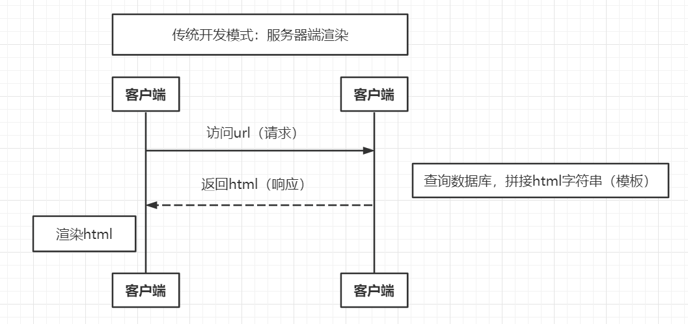
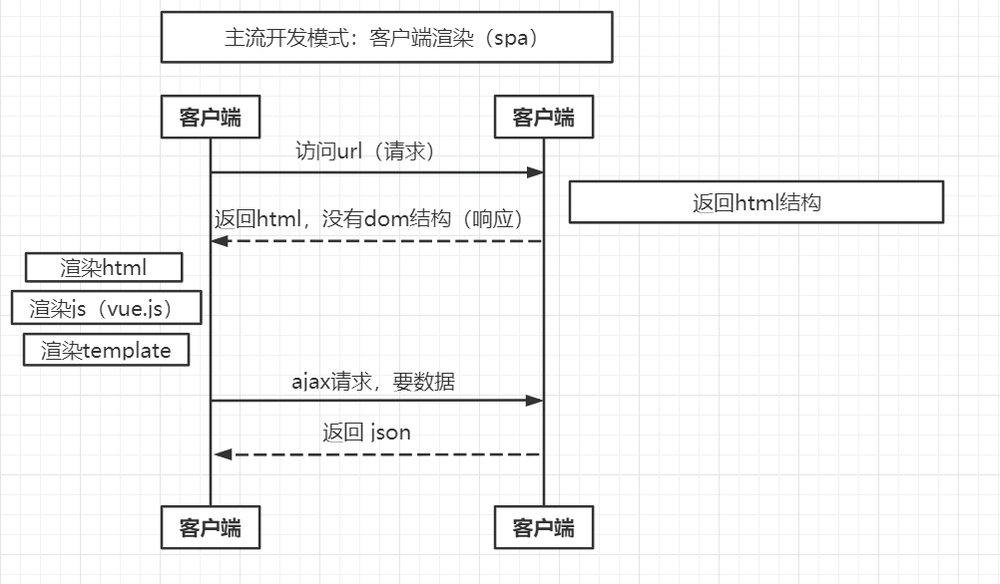
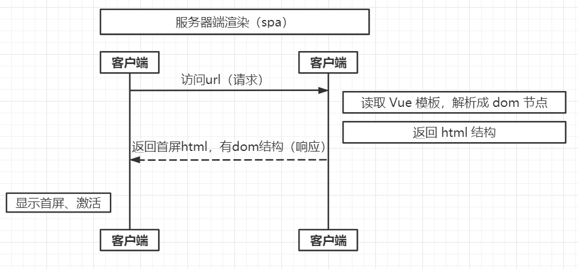

# vue-ssr

## 传统 web 网页内容在服务端渲染完成（html、ajax。。。），一次性传输到浏览器直接展示即可，查看网页源码，浏览器拿到的是完整的dom
  
  注意：服务端可没有dom，都是嵌套变量注入数据

## 客户端渲染，服务端返回给客户端的只是页面骨架，没有实际内容，真正内容是在客户端使用 js 动态生成的

-  多页：每加载一个页面，都要重新请求资源（公共、自有），造成资源浪费和加大服务器压力
-  单页（主流）：只有一个页面，一次请求公共资源，通过路由来控制跳转到自有页面，再请求自有资源，合理请求资源，提升页面性能，加快渲染速度，减轻服务器压力
   -  缺点：
      1. seo
      2. 首屏加载速度

      - 优点：
        1. 渲染计算放到客户端，解放服务端，前后端分离，专攻各自端，提升开发效率
        2. 省流量

## 服务器端渲染 Server Side Render
  SSR解决⽅案，后端渲染出完整的⾸屏的dom结构返回，前端拿到的内容包括⾸屏及完整spa结构，
  应⽤激活后依然按照spa⽅式运⾏，这种⻚⾯渲染⽅式被称为服务端渲染 (server side render)

